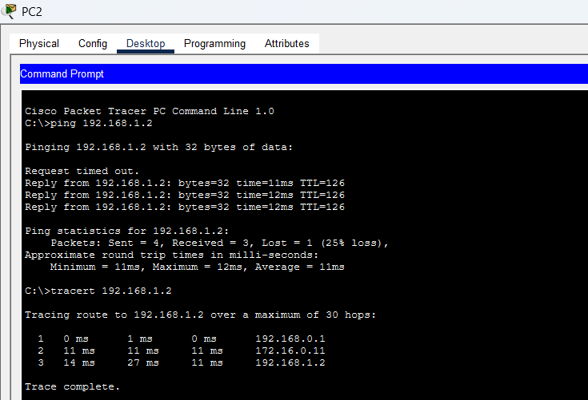
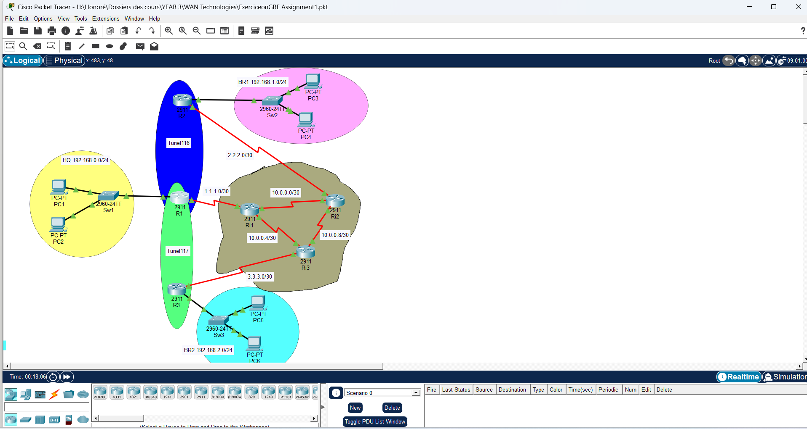

# Cisco GRE Tunnelling — Full-Mesh Multi-Site WAN over an ISP Backbone

<p align="left">
  
  
  
  
  
</p>

A three-site enterprise WAN where **HQ and two branch offices are connected by a full mesh of GRE tunnels** that ride across a provider backbone the enterprise does not control. The ISP forwards only public-IP traffic; the private LANs behind each site reach each other as if they were directly connected.

---

## The problem

Three offices, each with its own private LAN, are connected to the internet through separate ISP links:

- **HQ** — `192.168.0.0/24`, connects to the provider on `1.1.1.1`
- **Branch 1 (BR1)** — `192.168.1.0/24`, connects on `2.2.2.2`
- **Branch 2 (BR2)** — `192.168.2.0/24`, connects on `3.3.3.3`

The ISP backbone routes **public addresses only**. It has no route to `192.168.x.x`, and it should not: private ranges are not globally routable, and the enterprise does not want its internal addressing exposed to or dependent on the provider. Without a tunnel, a host in HQ simply cannot reach a host in BR1 — the first ISP router drops the packet for lack of a route.

## The solution

**GRE (Generic Routing Encapsulation)** wraps each private IP packet inside a new packet addressed from one site's public IP to another's. The provider sees only `1.1.1.1 → 2.2.2.2` and forwards it normally. The receiving router strips the outer header and delivers the original packet to its LAN.

Three tunnels are built so that every site can reach every other site directly, without hair-pinning through HQ:

| Tunnel | Endpoints | Tunnel subnet | Carries |
|--------|-----------|---------------|---------|
| **Tunnel116** | R1 ↔ R2 | `172.16.0.0/24` | HQ ↔ BR1 |
| **Tunnel117** | R1 ↔ R3 | `172.17.0.0/24` | HQ ↔ BR2 |
| **Tunnel118** | R2 ↔ R3 | `172.18.0.0/24` | BR1 ↔ BR2 |

Each site router therefore terminates **two** tunnels — a full mesh across three sites.

---

## Topology


### Customer edge routers

| Router | Site | LAN | WAN (public) | Tunnels terminated |
|--------|------|-----|--------------|--------------------|
| **R1** | HQ | `192.168.0.1/24` | `1.1.1.1/24` → Ri1 | Tunnel116 (`172.16.0.10`), Tunnel117 (`172.17.0.10`) |
| **R2** | BR1 | `192.168.1.1/24` | `2.2.2.2/24` → Ri2 | Tunnel116 (`172.16.0.11`), Tunnel118 (`172.18.0.10`) |
| **R3** | BR2 | `192.168.2.1/24` | `3.3.3.3/24` → Ri3 | Tunnel117 (`172.17.0.11`), Tunnel118 (`172.18.0.11`) |

### ISP backbone (transit only)

| Router | Customer link | Backbone links |
|--------|--------------|----------------|
| **Ri1** | R1 on `1.1.1.2` | Ri2 (`10.0.0.0/30`), Ri3 (`10.0.0.4/30`) |
| **Ri2** | R2 | Ri1, Ri3 (`10.0.0.8/30`) |
| **Ri3** | R3 on `3.3.3.1` | Ri1, Ri2 |

The three ISP routers form a triangle, giving redundant paths across the provider core. **None of them carries a single route to a `192.168.x.x` network** — that is the point of the design.

---

## How the encapsulation works

A ping from PC1 (HQ, `192.168.0.2`) to PC3 (BR1, `192.168.1.2`) travels like this:

```
1. PC1 sends:            [ IP 192.168.0.2 → 192.168.1.2 ][ ICMP ]

2. R1 matches its route to 192.168.1.0/24 via 172.16.0.11 (Tunnel116),
   and encapsulates:     [ IP 1.1.1.1 → 2.2.2.2 ][ GRE ][ IP 192.168.0.2 → 192.168.1.2 ][ ICMP ]

3. ISP core (Ri1→Ri2) forwards on the OUTER header only.
   It never inspects or routes the private addresses inside.

4. R2 receives, strips the outer IP + GRE headers, and recovers:
                         [ IP 192.168.0.2 → 192.168.1.2 ][ ICMP ]

5. R2 delivers it to PC3 on its local LAN.
```

---

## Configuration

### Building a GRE tunnel (R1 → R2, `Tunnel116`)

```cisco
interface Tunnel116
 ip address 172.16.0.10 255.255.255.0
 mtu 1476
 tunnel source Serial0/0/0        ! local WAN interface (1.1.1.1)
 tunnel destination 2.2.2.2       ! remote site's public IP
```

Four lines do the work:

- **`ip address`** — the tunnel is a virtual point-to-point link and needs its own subnet, separate from both the LAN and WAN addressing.
- **`tunnel source`** — the interface (or IP) used as the **outer** source address.
- **`tunnel destination`** — the remote peer's public IP, which must be reachable through the ISP *before* the tunnel can come up.
- **`mtu 1476`** — GRE adds a 24-byte overhead (20-byte outer IP + 4-byte GRE) to every packet. Lowering the tunnel MTU from 1500 to **1476** keeps the encapsulated packet within the physical MTU and avoids fragmentation, which would otherwise cost performance and can break path-MTU discovery.

### Routing: two layers, two purposes

Each site router needs **two kinds of static route**, and mixing them up is the usual reason a GRE lab fails:

```cisco
! (a) UNDERLAY — reach the remote PUBLIC IPs through the ISP.
!     Without these, the tunnel destination is unreachable and the tunnel stays down.
ip route 2.2.2.0 255.255.255.0 1.1.1.2
ip route 3.3.3.0 255.255.255.0 1.1.1.2

! (b) OVERLAY — reach the remote PRIVATE LANs through the tunnel interfaces.
ip route 192.168.1.0 255.255.255.0 172.16.0.11    ! via Tunnel116 → BR1
ip route 192.168.2.0 255.255.255.0 172.17.0.11    ! via Tunnel117 → BR2
```

The underlay routes point at the **ISP next hop**; the overlay routes point at the **far end of a tunnel**. The tunnel cannot form without (a), and no user traffic crosses it without (b).

### ISP core routers

The provider routers carry public and backbone prefixes only:

```cisco
ip route 10.0.0.0 255.255.255.252 10.0.0.2
ip route 10.0.0.4 255.255.255.252 10.0.0.6
ip route 10.0.0.8 255.255.255.252 10.0.0.2
ip route 2.2.2.0 255.255.255.0 10.0.0.2
ip route 3.3.3.0 255.255.255.0 10.0.0.6
```

No `192.168.x.x` entries anywhere — confirming the private networks are invisible to the provider.

> Enable passwords are replaced with `<removed>` in the published configs. The working configuration is intact in the `.pkt` file.

---

## Verification

### HQ → Branch 1, across Tunnel116



```
C:\>tracert 192.168.1.2

  1    0 ms    1 ms    0 ms   192.168.0.1     ← R1, the HQ default gateway
  2   11 ms   11 ms   11 ms   172.16.0.11     ← R2's Tunnel116 endpoint
  3   14 ms   27 ms   11 ms   192.168.1.2     ← PC3 on the BR1 LAN
```

### HQ → Branch 2, across Tunnel117



```
C:\>tracert 192.168.2.2

  1    0 ms    1 ms    0 ms   192.168.0.1     ← R1
  2   14 ms   11 ms   12 ms   172.17.0.11     ← R3's Tunnel117 endpoint
  3   13 ms   11 ms   12 ms   192.168.2.2     ← PC5 on the BR2 LAN
```

### Reading the result

Both traces complete in **three hops**, and hop 2 is a **tunnel** address (`172.16.0.11`, `172.17.0.11`) — never an ISP address. The physical path actually crosses Ri1 and Ri2 (or Ri3), but those routers decrement the TTL of the *outer* header only, so they never appear in the trace.

**To the LANs, the three sites look directly adjacent.** That is exactly what a working GRE overlay should produce, and it is visible proof the tunnels are up and carrying traffic.

*(The single dropped packet at the start of each ping is normal in Packet Tracer: the first echo request is consumed while ARP and the tunnel state resolve.)*

---

## Repository structure

```
cisco-gre-wan-tunnelling/
├── EXERCICE_Application_of_GRE_in_a_wide_ISP.pkt   ← full Packet Tracer file
├── configs/
│   ├── r1-hq.txt                    ← HQ router: Tunnel116 + Tunnel117
│   ├── r2-br1.txt                   ← Branch 1: Tunnel116 + Tunnel118
│   └── r3-br2-and-isp-core.txt      ← Branch 2 (Tunnel117 + Tunnel118) and an ISP core router
├── topology.png
├── traceroute-hq-to-br1.png
├── traceroute-hq-to-br2.png
└── README.md
```

Ri1, Ri2 and Ri3 are structurally identical transit routers, so one representative configuration is published rather than three near-copies.

---

## Running it

1. Install [Cisco Packet Tracer](https://www.netacad.com/courses/packet-tracer) (free with a Cisco NetAcad account).
2. Open `EXERCICE_Application_of_GRE_in_a_wide_ISP.pkt`.
3. From PC2 in the HQ LAN:
   - `ping 192.168.1.2` and `tracert 192.168.1.2` → Branch 1 via Tunnel116
   - `ping 192.168.2.2` and `tracert 192.168.2.2` → Branch 2 via Tunnel117
4. On R1, inspect the tunnels:
   - `show ip interface brief` — Tunnel116/117 should be up/up
   - `show interface tunnel 116` — source, destination and MTU
   - `show ip route` — note tunnel next hops for the `192.168.x.0` prefixes
5. To prove the ISP is unaware of the private networks, open Ri1 and run `show ip route`: no `192.168.x.x` entry exists.

---

## What this lab demonstrates

- Designing an **overlay network** on top of infrastructure you do not control.
- Configuring GRE tunnel interfaces: source, destination, addressing and MTU.
- Separating **underlay** routing (public reachability, required for the tunnel to form) from **overlay** routing (private reachability through the tunnel).
- Calculating and applying the **1476-byte MTU** to account for GRE overhead.
- Building a **full mesh** so branch-to-branch traffic does not need to transit HQ.
- Using `traceroute` as evidence that encapsulation is genuinely in effect.

**A note on security:** GRE encapsulates but does **not** encrypt — anyone able to capture traffic on the provider path can read the inner packet. In production, GRE is normally paired with IPSec (GRE over IPSec) to add confidentiality and integrity, combining GRE's ability to carry routing protocols and multicast with IPSec's protection.

---

## Author

**Louis Honoré LOUA** — Network Engineer
BSc Computer Science (Network Engineering), INES-Ruhengeri, Rwanda
📧 louishonoreloua2026@gmail.com · 🌐 [louis-honore-loua.github.io](https://louis-honore-loua.github.io) · 💻 [github.com/Louis-Honore-LOUA](https://github.com/Louis-Honore-LOUA)
