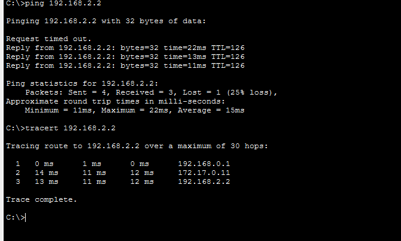

# Cisco GRE Tunnelling — Multi-Site WAN over ISP

<p align="left">
  
  
  
  
  
</p>

Implementation of **GRE (Generic Routing Encapsulation) tunnels** connecting three sites (HQ + 2 branches) across an ISP backbone. Each site router maintains a full mesh of GRE tunnels to the other two, allowing private LAN traffic to flow transparently over the public WAN.

---

## 🎯 Objective

Connect three private LAN segments across an untrusted ISP backbone using GRE tunnels, so that the ISP routers only see encapsulated public-IP traffic — never the private LAN addresses. Three tunnels form a **full mesh** between all three sites.

---

## 🏗️ Topology



### Customer Sites

| Router | Site | WAN IP | LAN Subnet | Tunnels |
|--------|------|--------|------------|---------|
| R1 | HQ (192.168.0.0/24) | 1.1.1.1/24 | 192.168.0.0/24 | Tunnel116→R2, Tunnel117→R3 |
| R2 | BR1 (192.168.1.0/24) | 2.2.2.2/24 | 192.168.1.0/24 | Tunnel116→R1, Tunnel118→R3 |
| R3 | BR2 (192.168.2.0/24) | 3.3.3.3/24 | 192.168.2.0/24 | Tunnel117→R1, Tunnel118→R2 |

### ISP Backbone

| Router | Role | Interfaces |
|--------|------|-----------|
| Ri1 | ISP core | Connects to R1 (1.1.1.x), Ri2 (10.0.0.0/30), Ri3 (10.0.0.4/30) |
| Ri2 | ISP core | Connects to R2 (2.2.2.x), Ri1, Ri3 (10.0.0.8/30) |
| Ri3 | ISP core | Connects to R3 (3.3.3.x), Ri1, Ri2 |

### GRE Tunnel Address Space

| Tunnel | Endpoints | Tunnel Network |
|--------|-----------|---------------|
| Tunnel116 | R1 ↔ R2 | 172.16.0.0/24 |
| Tunnel117 | R1 ↔ R3 | 172.17.0.0/24 |
| Tunnel118 | R2 ↔ R3 | 172.18.0.0/24 |

---

## ⚙️ GRE Tunnel Configuration (R1 example)

```
! Tunnel to R2 (source = R1 WAN IP, destination = R2 WAN IP)
interface Tunnel116
 ip address 172.16.0.10 255.255.255.0
 mtu 1476
 tunnel source Serial0/0/0
 tunnel destination 2.2.2.2

! Tunnel to R3
interface Tunnel117
 ip address 172.17.0.10 255.255.255.0
 mtu 1476
 tunnel source Serial0/0/0
 tunnel destination 3.3.3.3

! Static routes: reach remote LANs via tunnel IPs
ip route 192.168.1.0 255.255.255.0 172.16.0.11   ! via Tunnel116
ip route 192.168.2.0 255.255.255.0 172.17.0.11   ! via Tunnel117

! Static routes: reach remote WAN IPs via ISP
ip route 2.2.2.0 255.255.255.0 1.1.1.2
ip route 3.3.3.0 255.255.255.0 1.1.1.2
```

**Key parameter — MTU 1476:** GRE adds a 24-byte header overhead to each packet. Setting `mtu 1476` (1500 − 24) prevents fragmentation on the WAN.

---

## ✅ Verification

**Traceroute from PC2 (HQ) to PC3 (BR1):**
```
C:\>tracert 192.168.1.2

  1    0 ms    1 ms    0 ms  192.168.0.1     ← R1 LAN interface
  2   11 ms   11 ms   11 ms  172.16.0.11     ← GRE tunnel endpoint (R2)
  3   14 ms   27 ms   11 ms  192.168.1.2     ← BR1 LAN host
```

The ISP core routers (Ri1, Ri2, Ri3) are **invisible** — traffic hops directly from R1 to the GRE tunnel endpoint on R2, proving the tunnel is active and encapsulating the path.

**Traceroute from PC2 (HQ) to PC5 (BR2):**
```
C:\>tracert 192.168.2.2

  1    0 ms    1 ms    0 ms  192.168.0.1     ← R1 LAN interface
  2   14 ms   11 ms   12 ms  172.17.0.11     ← GRE tunnel endpoint (R3)
  3   13 ms   11 ms   12 ms  192.168.2.2     ← BR2 LAN host
```

---

## 📁 Repository Structure

```
cisco-gre-wan-tunnelling/
├── ExerciceonGRE_Assignment1.pkt      ← Full Packet Tracer file
├── configs/
│   ├── r1-hq.txt                      ← R1 (HQ) config
│   ├── r2-br1.txt                     ← R2 (Branch 1) config
│   └── r3-br2-and-isp-core.txt        ← R3 + Ri1/Ri2/Ri3 configs
├── topology.png                        ← Network topology
├── traceroute-hq-to-br1.png           ← Traceroute proof (HQ → BR1)
├── traceroute-hq-to-br2.png           ← Traceroute proof (HQ → BR2)
└── README.md
```

---

## 🚀 How to Open

1. Install [Cisco Packet Tracer](https://www.netacad.com/courses/packet-tracer).
2. Open `ExerciceonGRE_Assignment1.pkt`.
3. From PC2, run:
   - `ping 192.168.1.2` then `tracert 192.168.1.2` (HQ → BR1 via Tunnel116)
   - `ping 192.168.2.2` then `tracert 192.168.2.2` (HQ → BR2 via Tunnel117)
4. Use `show interface tunnel 116` on R1 to inspect GRE tunnel status.

---

## 👤 Author

**Louis Honoré LOUA** — Network Engineer
BSc Computer Science (Network Engineering), INES-Ruhengeri, Rwanda
📧 louishonoreloua2026@gmail.com · 🌐 [louis-honore-loua.github.io](https://louis-honore-loua.github.io)
